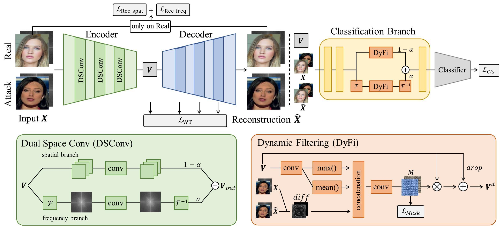
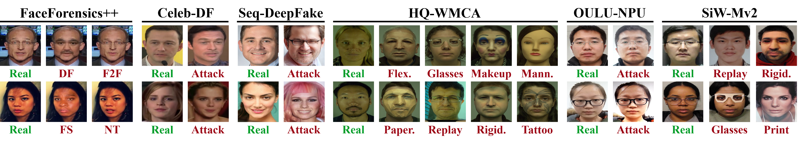

<p align="center">

  <h1 align="center">Towards Unified Defense for Face Forgery and Spoofing Attacks via Dual Space Reconstruction Learning</h1>
  <p align="center">
    Junyi Cao
    ·
    Ke-Yue Zhang
    ·
    Taiping Yao
    ·
    Shouhong Ding
    ·
    Xiaokang Yang
    ·
    Chao Ma

  </p>
  <h3 align="center"><a href="https://doi.org/10.1007/s11263-024-02151-2" target="_blank">Paper</a> | <a href="#uniattack-benchmark"><i>UniAttack</i> Benchmark </a></h3>
  <div align="center"></div>
</p>


<p align="center">
  <a href="">
    
  </a>
</p>

<p align="center">
We propose a dual space reconstruction framework to detect face forgery and spoofing attacks simultaneously by focusing on the commonalities of real faces in spatial and frequency domains. In addition, we release the <i>UniAttack</i> benchmark, which covers both digital manipulations and physical presentation attacks, to evaluate the performance of face attack detectors in a more realistic scenario.</p>
<br>


**Please consider citing our paper if you find it interesting or helpful to your research.**

```
@article{Cao_2024_IJCV,
  author    = {Cao, Junyi and Zhang, Ke-Yue and Yao, Taiping and Ding, Shouhong and Yang, Xiaokang and Ma, Chao},
  title     = {Towards Unified Defense for Face Forgery and Spoofing Attacks via Dual Space Reconstruction Learning},
  journal   = {International Journal of Computer Vision (IJCV)},
  year      = {2024},
  pages     = {1--26},
  publisher = {Springer}
}
```

```
@inproceedings{Cao_2022_CVPR,
    author    = {Cao, Junyi and Ma, Chao and Yao, Taiping and Chen, Shen and Ding, Shouhong and Yang, Xiaokang},
    title     = {End-to-End Reconstruction-Classification Learning for Face Forgery Detection},
    booktitle = {Proceedings of the IEEE/CVF Conference on Computer Vision and Pattern Recognition (CVPR)},
    month     = {June},
    year      = {2022},
    pages     = {4113-4122}
}
```


----

### Basic Requirements
Please ensure that you have already installed the following packages.
- [Pytorch](https://pytorch.org/get-started/previous-versions/) 1.12.1
- [Torchvision](https://pytorch.org/get-started/previous-versions/) 0.13.1
- [Albumentations](https://albumentations.ai/docs/getting_started/installation/) 1.4.2
- [Timm](https://github.com/rwightman/pytorch-image-models) 0.9.16
- [WandB](https://docs.wandb.ai/quickstart) 0.16.3
- [Scipy](https://pypi.org/project/scipy/#history) 1.10.1
- [Scikit-learn](https://scikit-learn.org/1.3/install.html) 1.3.2
- [PyYaml](https://pypi.org/project/PyYAML/#history) 6.0.1
- [OpenCV](https://github.com/opencv/opencv-python) 4.9.0.80
- [Lmdb](https://github.com/jnwatson/py-lmdb) 1.4.1
- [Tqdm](https://github.com/tqdm/tqdm) 4.66.2

### Dataset Preparation
- We include the dataset loaders and training engines for
  - Face Forgery Detection Benchmarks: [FaceForensics++](https://github.com/ondyari/FaceForensics), [Celeb-DF](https://www.cs.albany.edu/~lsw/celeb-deepfakeforensics.html), and [WildDeepfake](https://github.com/deepfakeinthewild/deepfake-in-the-wild).
  - Face Anti-Spoofing Benchmark: OCIM (including [OULU-NPU](https://ieeexplore.ieee.org/document/7961798), [CASIA-MFSD](https://ieeexplore.ieee.org/document/6199754), [replay-attack](https://ieeexplore.ieee.org/document/6313548), and [MSU-MFSD](https://ieeexplore.ieee.org/abstract/document/7031384)).
  - *UniAttack* Benchmark.
- For face forgery detection and face anti-spoofing benchmarks, please follow their official dataset papers to download and process the data.

### *UniAttack* Benchmark
<p align="center">
  <a href="">
    
  </a>
</p>

- Our pre-processed *UniAttack* benchmark data (in lmdb format) could be accessed through [OneDrive](https://1drv.ms/f/c/3f1ccc11f481c100/Eqbq_h7oLWFBhosRHFKxlvQB6svG5MoTrcn9qRfPQ4Ub2A?e=XyxqSK) with password `b,Y5m>gp`.
- Brief description (please refer to Section 4 of [the manuscript](https://doi.org/10.1007/s11263-024-02151-2) for details):
  - **Motivation** · In real-world scenarios, the integrity of deployed face recognition systems is threatened by both digitally manipulated face forgeries and physically crafted spoofing samples. *UniAttack* is thus proposed to evaluate model performance on the unified detection of face forgery and spoofing attacks.
  - **Data Composition** · *UniAttack* consists of 6 existing datasets. Three datasets are used for face forgery attacks: FaceForensics++, Celeb-DF, and Seq-DeepFake. Three datasets are used for face spoofing attacks: HQ-WMCA, OULU-NPU, and SiW-Mv2.
  - **Protocols** · *UniAttack* consists of 3 evaluation protocols: Protocol I evaluates intra-dataset performance; Protocol II evaluates cross-dataset performance; Protocol III evaluates cross-attack-type performance.


### Training
- Please first check the format of the configuration templates provided [here](config_template). Then, copy the templates into a new folder by:
  ```bash
  cp -r config_template config
  ```
- Please create a new folder `ckpt` and download imagenet pre-trained weights of [EfficientNet-b4](https://github.com/lukemelas/EfficientNet-PyTorch/releases/download/1.0/adv-efficientnet-b4-44fb3a87.pth), [ResNet18](https://download.pytorch.org/models/resnet18-5c106cde.pth), and [ResNet50](https://github.com/rwightman/pytorch-image-models/releases/download/v0.1-rsb-weights/resnet50_a1_0-14fe96d1.pth) inside `ckpt`.
  ```bash
  mkdir ckpt && cd ckpt
  wget https://github.com/lukemelas/EfficientNet-PyTorch/releases/download/1.0/adv-efficientnet-b4-44fb3a87.pth
  wget https://download.pytorch.org/models/resnet18-5c106cde.pth
  wget https://github.com/rwightman/pytorch-image-models/releases/download/v0.1-rsb-weights/resnet50_a1_0-14fe96d1.pth
  ```
- To start a training experiment, run the following script in your console. 
  ```bash
  CUDA_VISIBLE_DEVICES=0 python -m torch.distributed.launch --nproc_per_node=1 --master_port 10000 \
    main.py \
    --config path/to/model_config.yml \
    --engine $ENGINE
  ```
  - `--config`: Specify the path of the config file of a model (*i.e.,* the file name starts with a `model_` from the provided templates).
  - `--engine`: Choose from `FE` (for face forgery detection), `OCIM` (for face anti-spoofing), or `UE` (for *UniAttack* benchmark).
  - Run `python main.py --help` to see all command line arguments. 
- A concrete example to train our model on FaceForensics++:
  ```bash
  CUDA_VISIBLE_DEVICES=0 python -m torch.distributed.launch --nproc_per_node=1 --master_port 10000 \
    main.py \
    --config config/forgery/model_udeb4.yml \
    --engine FE
  ```
- A concrete example to train our model on OCIM:
  ```bash
  CUDA_VISIBLE_DEVICES=0 python -m torch.distributed.launch --nproc_per_node=1 --master_port 10000 \
    main.py \
    --config config/ocim/model_udr18.yml \
    --engine OCIM
  ```
- A concrete example to train our model on *UniAttack*:
  ```bash
  CUDA_VISIBLE_DEVICES=0 python -m torch.distributed.launch --nproc_per_node=1 --master_port 10000 \
    main.py \
    --config config/uniatt/Prot1/model_udeb4.yml \
    --engine UE
  ```

### Testing
- To test a model, run the following script in your console. 
  ```bash
  python main.py --config path/to/model_config.yml --engine $ENGINE -r $GPU --test 
  ```
  - `--config`: Specify the path of the config file.
  - `-r`: Specify the GPU index to run the experiment.
